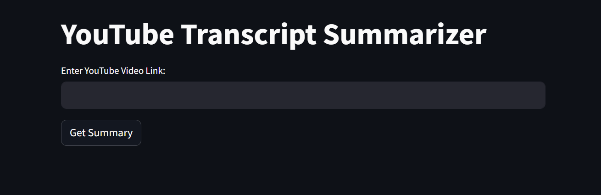
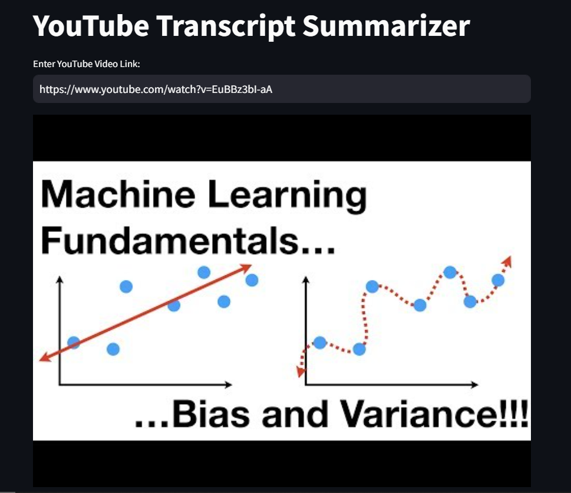
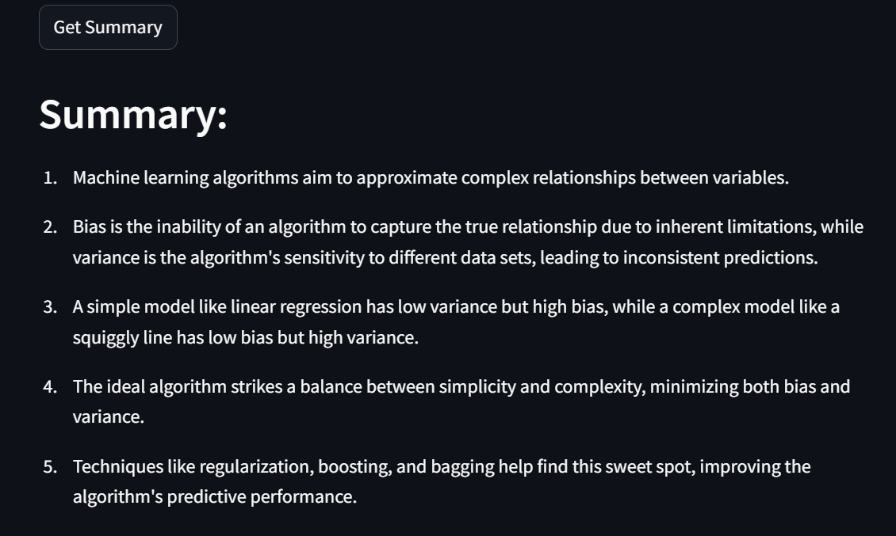

YouTube Summarizer

The project aims to automatically extract text and transcripts from YouTube videos using Google's Gemini API.
The video transcript API is used to fetch transcript details from YouTube videos.
A Streamlit app is created to take the YouTube link, display the video thumbnail, and generate a summary upon clicking the "Get Summary" button.

Image 1: Represents the developed user interface, showcasing the design and layout.

Image 2: Depicts the input YouTube link, display the video thumbnail.

Image 3: Illustrates summary generated by the application based on the user's input.
